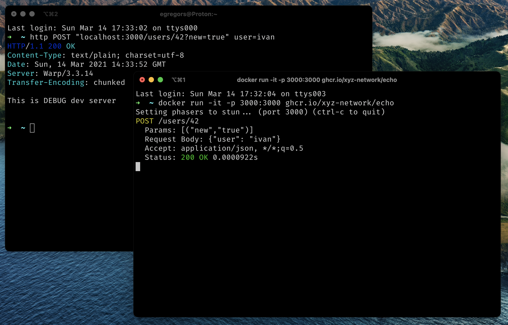

# echo


Just a HTTP requests logger.

## Usage

Take Docker image and run it. Server will start on `host:3000`
```shell
docker run -it -p 3000:3000 ghcr.io/xyz-network/echo
```



## Development

Update packages list, and install deps:

```shell
cabal update
cabal install
```

Run it locally:

```shell
cabal run
```

or like repl:

```shell
cabal repl
```

## Contributing

Bug reports, bug fixes and new features are always welcome. Please open issues and submit pull requests for any new code.